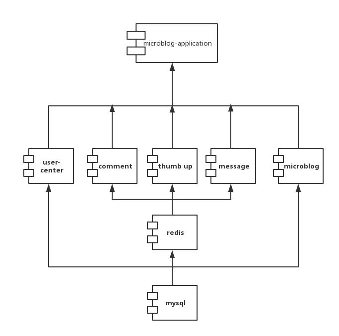

# 一个类微博项目
使用zookeeper，thrift来作为rpc框架
- zookeeper：实现了分布式锁，可以同时保证只有一个主机节点，主机节点管理从节点，从节点提供服务注册。
http://www.cnblogs.com/wuxl360/p/5817549.html
- thrift：Thrift是一个跨语言的服务部署框架，最初由Facebook于2007年开发，2008年进入Apache开源项目。Thrift通过一个中间语言(IDL, 接口定义语言)来定义RPC的接口和数据类型，然后通过一个编译器生成不同语言的代码（目前支持C++,Java, Python, PHP, Ruby, Erlang, Perl, Haskell, C#, Cocoa, Smalltalk和OCaml）,并由生成的代码负责RPC协议层和传输层的实现。
thrift：http://dongxicheng.org/search-engine/thrift-framework-intro/

应用结构如下：

依赖
- spring&spring mvc
- 数据库：采用MySQL和mybatis对数据进行持久化。
- rpc：zookeeper注册服务，服务自动发现，thrift完成rpc中对象传输。
- redis：由于comment，thumb up（点赞）， message（私信）调用频次比较高，因此使用redis对这些数据进行缓存，定时将其，减轻数据库压力。
    - 对于点赞信息：直接写到redis，定时刷新到mysql中去。
    - 对于其他信息：
        - 读:  读redis->没有，读mysql->把mysql数据写回redis
        - 写:  写mysql->成功，写redis

总结：系统分为用户中心组件，评论组件，点赞组件，私信组件和微博组件共同构成了微博应用。

<!--参考知识-->
<!--mybatis http://blog.csdn.net/column/details/mybatis-principle.html?page=1-->